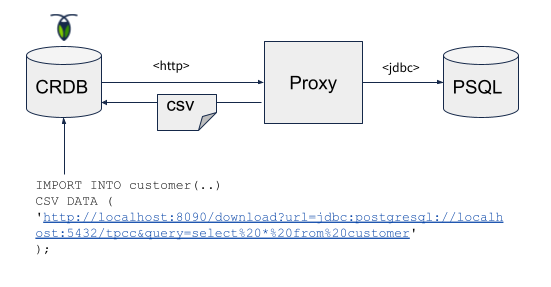

# Roach Pipe

A simple tool for streaming the contents of a JDBC source table (PostgreSQL, MySQL, Oracle etc) 
into CockroachDB using either 
[IMPORT](https://www.cockroachlabs.com/docs/stable/import.html) or 
[IMPORT INTO](https://www.cockroachlabs.com/docs/stable/import-into.html). 

# How it works

It works by simply creating a "pipe" to a source database via an HTTP endpoint. 
The endpoint controller receives a request for a CSV resource (table name or query), 
then queries the source database and iterates through the result set while writing 
to the HTTP output stream that CockroachDB reads. 

The streaming is asynchronous where input is read and written in chunks without
holding up threads. Multiple pipes can run quite efficiently at the same time.

# Motivations

While you already can import PostgreSQL dump files using IMPORT, there are 
situations where you prefer to use IMPORT INTO to an existing table, or do 
something with the source data before importing. IMPORT INTO only understands 
CSV and Avro OCF. 

A proxy layer like this also enables any kind of source besides a RDBMS like 
a queue or NoSQL database, and different source formats like JSON.

Typically, this is the sweet spot for the [Spring Batch](https://spring.io/projects/spring-batch)
framework, but it's also a more heavy-weight approach.

# Prerequisites

- JDK8+ with 1.8 language level (OpenJDK compatible)

Install the JDK (Linux):

    sudo apt-get -qq install -y openjdk-8-jdk

Clone the project:

    git clone git@github.com:kai-niemi/roach-pipe.git
    cd roach-pipe

Build the executable jar:

    chmod +x mvnw
    ./mvnw clean install

# Usage

Tutorial using the `tpcc` workload schema in CockroachDB.

## 1. Load TPCC data into CockroachDB

(To skip this step, just unzip the [tpcc-dump.zip](demo/tpcc-dump.zip) file and use that one)

First we need to create some data in CockroachDB that we later import to PostgreSQl.

    cockroach workload init tpcc
    
### 1.1 Dump the tpcc database to SQL file

    cockroach dump tpcc --insecure --url postgresql://root@localhost:26257?sslmode=disable > tpcc.dump.sql

### 1.2 Drop the tpcc database 

    cockroach sql tpcc --insecure --url postgresql://root@localhost:26257?sslmode=disable -e 'drop database tpcc'

### 1.3 Tweak the SQL file to load into PostgreSQL
         
PostgreSQL can't read CRDB dump DDL part, so replace the top section of tpcc-dump.sql
with [psql-tpcc-ddl.sql](demo/psql-tpcc-ddl.sql).

## 2. Load the SQL file into PostgreSQL

    postgres=# create database tpcc;
    postgres=# \c tpcc;
    tpcc=# \i demo/tpcc-dump.sql

## 3. Create the tpcc database in CockroachDB

    cockroach sql tpcc --insecure --url postgresql://root@localhost:26257?sslmode=disable -e 'create database tpcc'

## 4. Create the tpcc schema (only)

    cockroach sql tpcc --insecure --url postgresql://root@localhost:26257?sslmode=disable < demo/crdb-tpcc-ddl.sql

For reference, see [crdb-tpcc-ddl.sql](demo/crdb-tpcc-ddl.sql).

Now you should have a populated PostgreSQL tpcc database and an empty one in CockroachDB.
    
## 5. Build and start the proxy

    ./roach-pipe.jar

It's API root endpoint is now available at:

    open http://localhost:8090

Tip: You can change the port with:

    ./roach-pipe.jar --server.port=9999

Test the HTTP proxy with curl:

    curl --location --request GET 'http://localhost:8090/download?url=jdbc:postgresql://localhost:5432/tpcc&user=name&password=secret&table=customer'

It takes the following params:
    
- url - JDBC url to PostgreSQL database 
- user - JDBC user name
- password - JDBC password
- table - source table name if query isn't passed
- query - query to use (default `select * from table`)
- maxRows - max number of rows to query (default -1 meaning all)
- rowOffset - skip to given row if >0 (default 0)
- fetchSize - JDBC fetch size (default 256)

## 6. Run an import

Now lets import the customers table:

    import into customer(
        c_id,           
        c_d_id,         
        c_w_id,         
        c_first,
        c_middle,       
        c_last,         
        c_street_1,     
        c_street_2,     
        c_city,         
        c_state,
        c_zip,          
        c_phone,        
        c_since,        
        c_credit,
        c_credit_lim,   
        c_discount,     
        c_balance,      
        c_ytd_payment,  
        c_payment_cnt,  
        c_delivery_cnt,
        c_data)
    CSV DATA (
        'http://localhost:8090/download?url=jdbc:postgresql://localhost:5432/tpcc&user=postgres&password=xxxx&table=customer'
    );

            job_id       |  status   | fraction_completed | rows  | index_entries |  bytes
    ---------------------+-----------+--------------------+-------+---------------+-----------
      642529814063120385 | succeeded |                  1 | 30000 |         30000 | 18534141
    (1 row)
    
    Time: 5.321s total (execution 5.321s / network 0.000s)

Done! For one table, at least.

# Terms of Use

See [MIT](LICENSE.txt) for terms and conditions.

